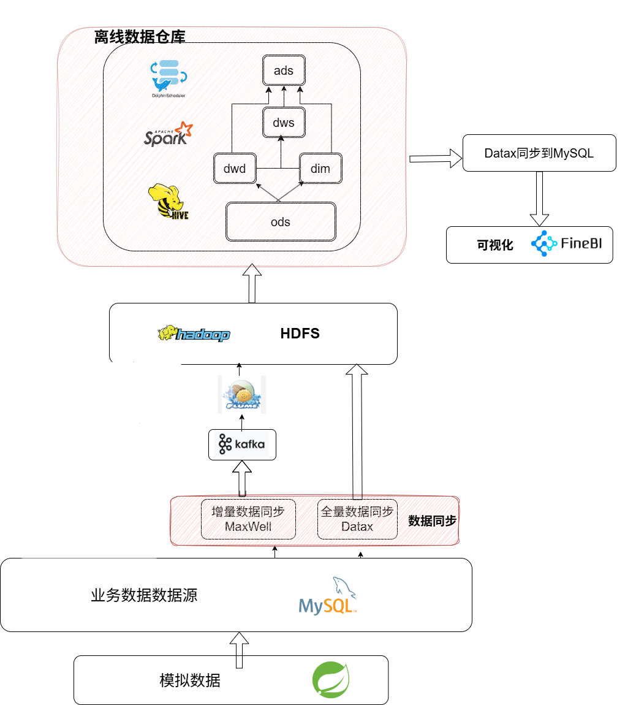
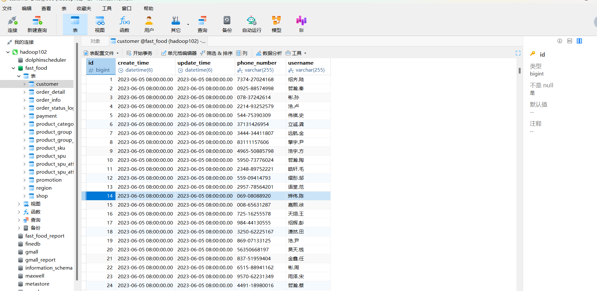
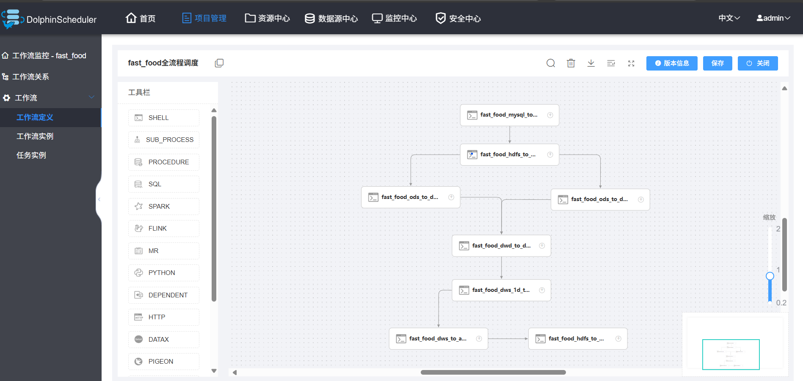
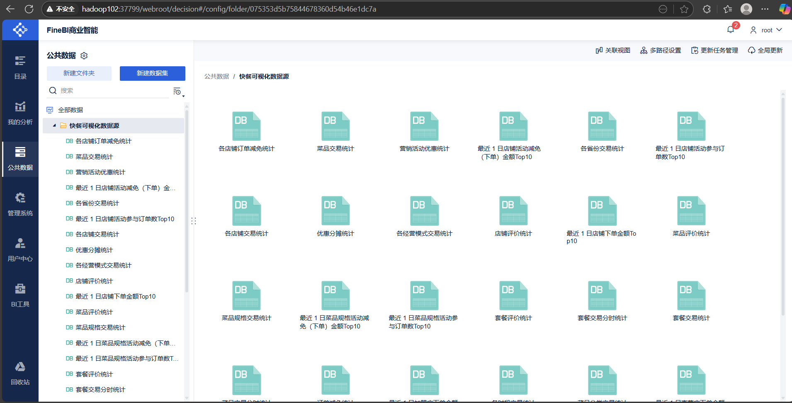
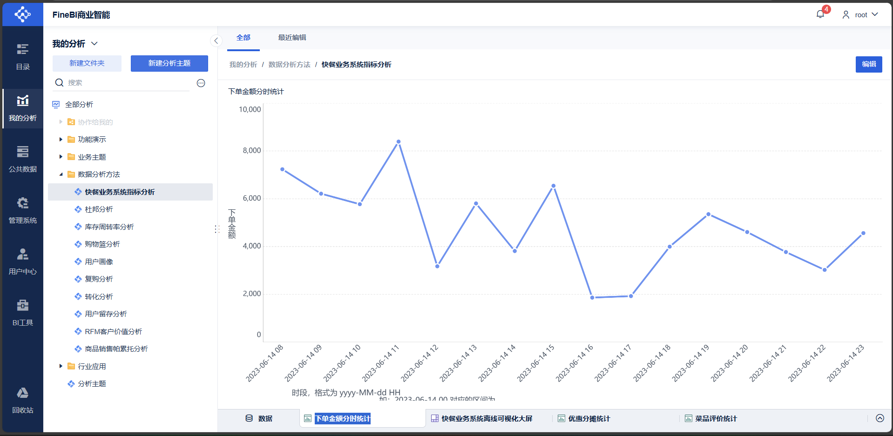
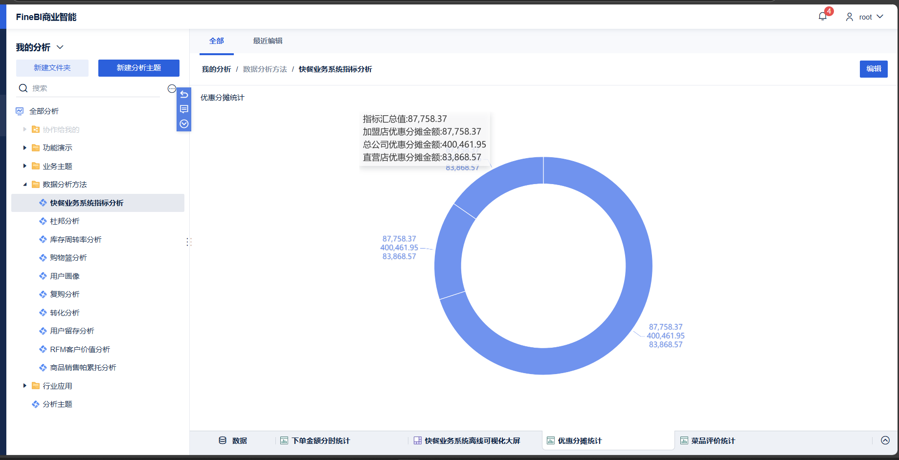
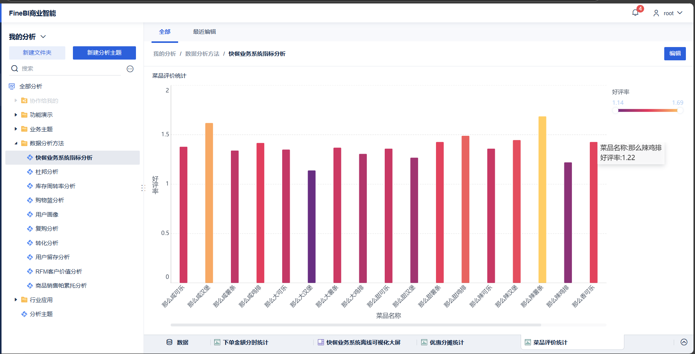
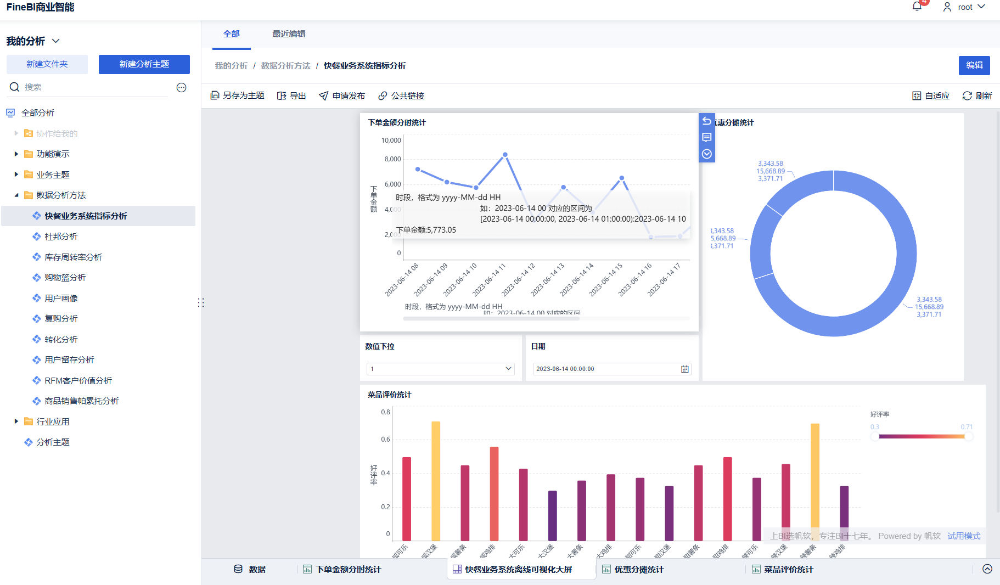

# FastFood Data WareHouse

## 目录

1. [项目简介](#一项目简介)
2. [技术架构](#二技术架构)
3. [任务调度界面](#三任务调度界面)
4. [软件版本](#四软件版本)
5. [数仓分层结构](#五数仓分层结构)
6. [模块说明](#六模块说明)
7. [运行说明](#七运行说明)
8. [示例图](#八示例图可视化效果展示)

## 一、项目简介

​	本项目是一个基于离线架构的**快餐业务数据仓库系统（FastFood Data Warehouse）**，专注于对企业日常经营数据进行采集、整合、建模和分析，帮助业务人员掌握运营情况、优化决策流程。

## 二、技术架构

**1.系统架构图**

------

**2.架构说明**

​	本数据仓库项目的整体流程分为数据采集、数据处理、数据建模和数据可视化四个阶段。项目完全基于离线架构，核心引擎采用 Hive on Spark，不包含用户行为数据。

​	首先，业务数据库（MySQL）中的结构化数据通过 DataX 工具进行全量同步、通过 Maxwell + Kafka 实现增量同步，最终写入 HDFS 形成原始数据，存储于 ODS 层。

​	在数据处理阶段，ODS 层的数据通过 Hive 外部分区表进行组织，并统一格式（字段类型、时间格式、压缩方式等），随后借助 Hive on Spark 执行 SQL 任务，将数据加工处理至 DWD 层。

​	在数据建模阶段，DWD 层完成明细数据清洗和维度关联，并构建表；接着在 DWS 层基于常用分析场景进行宽表聚合与公共指标沉淀；最终，在 ADS 层按照业务主题（如门店维度、时间维度、优惠活动等）构建面向可视化的指标汇总表。

​	最后，在数据可视化阶段，使用 FineBI 工具连接 ADS 层表，创建仪表板进行图表展示，支撑下单金额分时统计、优惠分摊分析、商品好评率排名等业务报表。

------

**3. 数据源模块**

- **业务数据**：源自本地 MySQL 中预置的快餐业务数据库，为数仓建模提供模拟业务数据基础。

------

**4.数据源截图示例**

 * **业务数据源截图**：

   **以customer表举例**

   

------

**5. 数据采集与同步模块**

- **数据采集**：
  - **全量同步**：通过 DataX 工具定时从 MySQL 中全量抽取业务表，直接写入 HDFS；
  - **增量同步**：利用 Maxwell 实时监听 MySQL Binlog，并将变更数据推送至 Kafka。Flume 消费 Kafka 中的增量事件，再将其落地到 HDFS，实现准实时数据采集。

------

**6. 数仓模块**

项目采用五层数仓建模架构：
ODS（Operation Data Store）→ DWD（Data Warehouse Detail ）→ DIM（Dimension）→ DWS（Data Warehouse Summary）→ ADS（Application Data Service）

Hive 作为数仓核心引擎，底层以 Spark 为执行计算框架，确保大数据量处理能力。

------

**7. 数据可视化模块**

ADS 层的结果数据通过脚本同步至 MySQL 数据库，供上层可视化工具读取。项目采用 **FineBI** 构建可视化大屏与指标仪表盘，实现数据价值的直观呈现。

## 三、任务调度界面

该界面展示了每日定时运行的 ETL 流程，主要包括数据采集、清洗、加载到数据仓库等任务节点。

## 四、软件版本

| 组件/框架        | 版本号 | 说明               |
| ---------------- | ------ | ------------------ |
| Hadoop           | 3.3.4  | HDFS 分布式存储    |
| Zookeeper        | 3.7.1  | Kafka 协调器       |
| MySQL            | 8.0.31 | 业务数据存储       |
| Hive             | 3.1.3  | Hive on Spark      |
| Flume            | 1.10.1 | 日志采集工具       |
| Kafka            | 3.3.1  | 日志消息队列       |
| Spark            | 3.3.1  | Hive 执行引擎      |
| DataX            | 3.0    | MySQL 全量同步工具 |
| Maxwell          | 1.29.2 | MySQL 增量同步工具 |
| DolphinScheduler | 2.0.5  | 离线调度系统       |
| FineBI           | 6.0    | 数据可视化 BI 工具 |

## 五、数仓分层结构

- **ODS 层**：业务数据的原始接入层；
- **DWD 层**：对 ODS 层数据进行清洗、结构化、归类，形成事实明细表；
- **DIM 层**：构建维度宽表与拉链表，为业务建模提供维度支撑；
- **DWS 层**：基于 DWD + DIM 构建用户、订单等多维度的宽表和周期性汇总表；
- **ADS 层**：沉淀核心指标数据，供 FindBI 读取。

## 六、模块说明

- `/sql/`：Hive 建表、分层 ETL 脚本
- `/scripts/`：采集脚本（Flume、DataX、MaxWell）、调度脚本、集群启动脚本
- `/config/`：Hive的配置文件
- `/mockdata/`：生成模拟数据的 Jar、配置
- `/docs`:存放架构图、数据源、调度以及可视化截图

## 七、运行说明

1. 按照 `/scripts/cluster-control`中的集群启动脚本启动集群
2. 启动模拟数据生成脚本
3. 依次运行 Hive 建表与 ETL 脚本
4. 启动调度任务（如 DolphinScheduler），由于内存资源不足，故采用手动输入命令的方式运行所有调度脚本
5. 连接FindBI 展示结果

## 八、示例图（可视化效果展示）

以下图表截图展示了从 ADS 层同步至 MySQL 后，使用 FindBI可视化的业务指标：

* **数据库连接FineBI**

- **下单金额分时统计折线图**

  

- **优惠分摊统计图**

  

- **菜品评价统计**

  

- **快餐业务系统离线可视化大屏**

  

---

